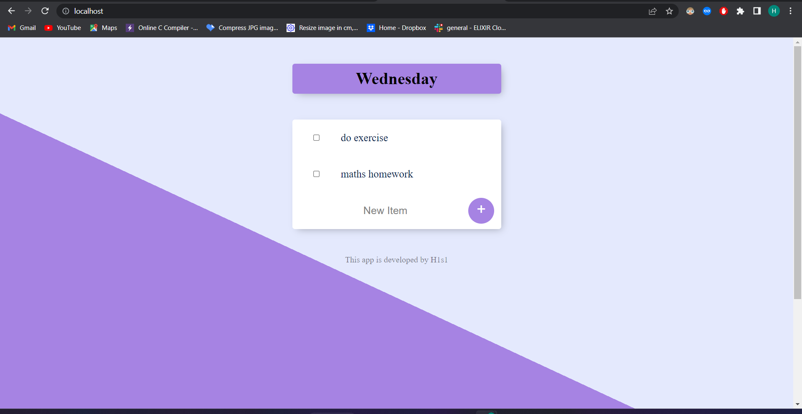
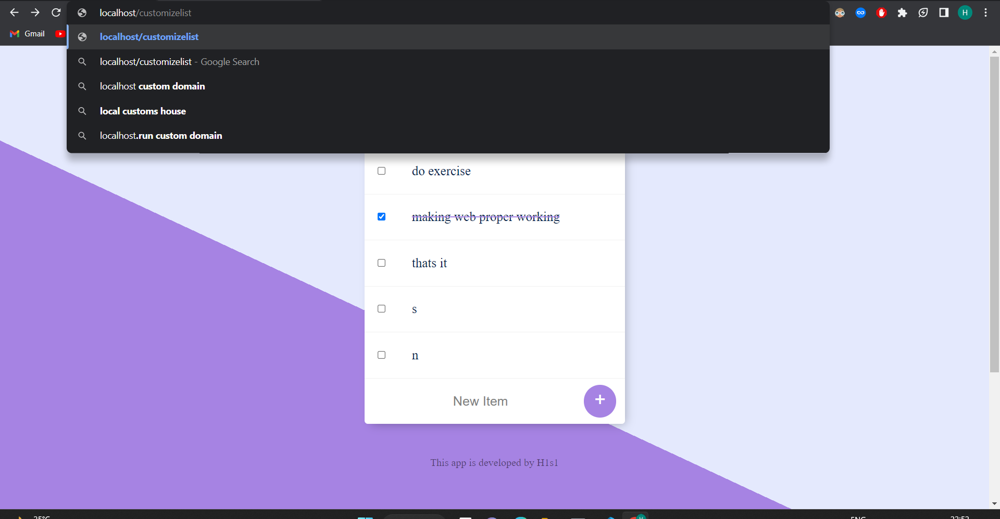
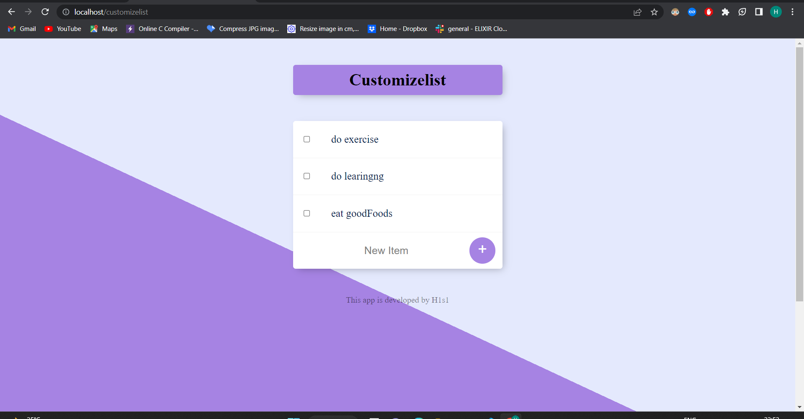
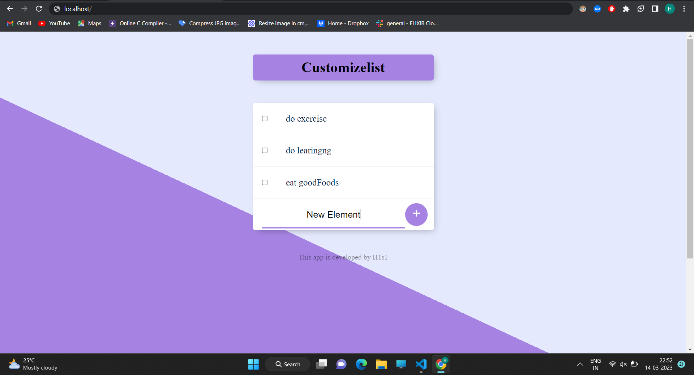
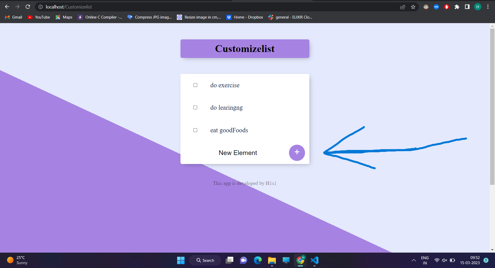
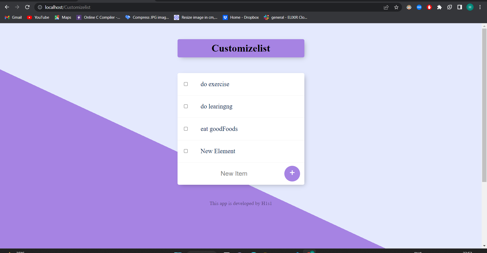
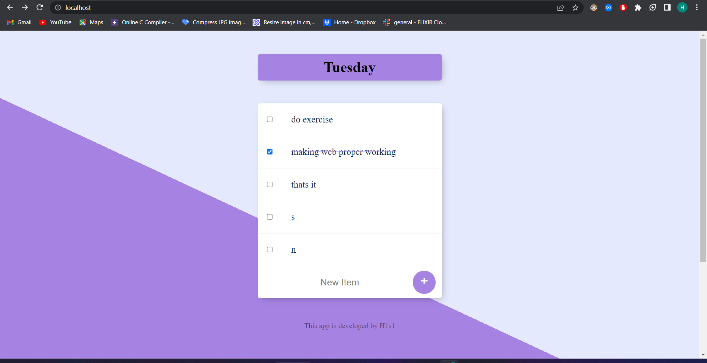

# To-DoList-Repo
 Great programer says that if you want to solve a big problem , divide that big problem into small subproblems ,
 than solve the small problems , smoothly you will concure the big problem . 
 This concept of programing can be used in our day to day life for accomplishing the large goals and for achiving this large goals 
 one should set small targets or tasks . 
 To-DoList web app will help you in managing your tasks , with the help of this application you can easily list out all the task 
 you want to perform in near future . Any new task can be added to the list and any task can be removed once you completed . Multiple
 list of tasks can be created.
 
 ## Home page

List Title will be the day when you open web app

## Customise list
This application can create list of your choice , Type the name of list you want to create in serch box with "/" in front of it . for example let's create list 
of name "customizelist" 

after writing the name of list just press eneter , you will get the list with list Title of your choise with some default element in it 

## Adding new element in list
New item can be added on the list by following steps

1.at bottom of the list there is one blank space , type your new item  or new element there

2. Than press the button beside blank space having "+" symbol on it

new item or task will get added to your list

## Deleting an element from list
For deleting a task or item from your list click the check box beside that item or task.

item or task with checked box will get removed from the list

